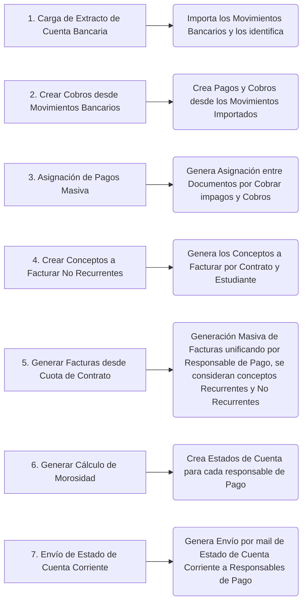
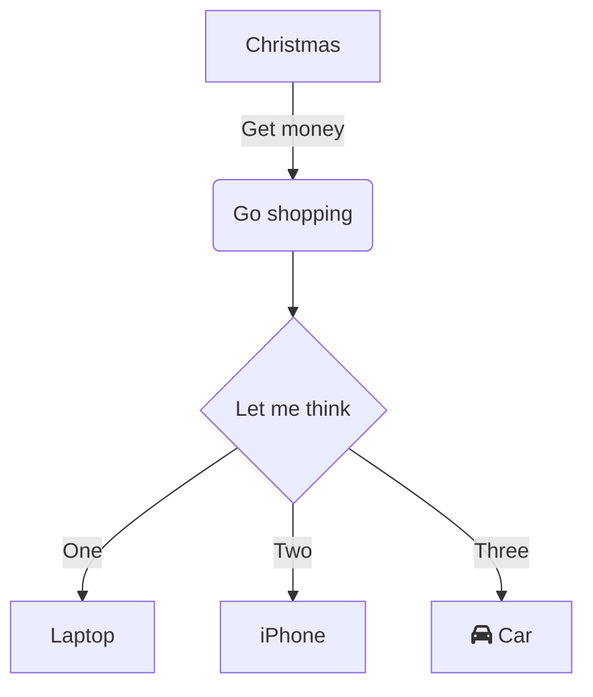

## Flujo Instituciones educativas

### Circuito inicial

### Crear Contrato de Servicios

El Contrato de Servicio es un acuerdo de condiciones entre la institución educativa y el estudiante. 
Es posible definir estas condiciones desde entidades vinculadas al mismo Contrato como ser: Descuentos, tipo de recurrencia (anual, mensual), etc.

**Para mayor información sobre Contrato de Servicios:** - [Contrato de Servicio](service-education-contract)

Una vez creados los diferentes Cursos como productos de servicio (el sistema permite importarlos de forma masiva), es posible cargar los contratos desde un importador, cargando en la misma importación tanto el contrato, el socio del negocio (estudiante), la familia (y sus miembros) y definir el responsable de pago.

### Crear Líneas desde Contrato

En la línea del contrato quedará definido el Producto de servicio (el curso en este caso), la frecuencia, el tipo de frecuencia (mensual, anual) y el precio, entre otros datos básicos.
La línea será creada en forma automática en el caso de utilizar el proceso de importar contratos (con sus correspondientes datos obligatorios).

En la pestaña Cuotas podrán visualizarse los conceptos a facturar vinculados al Contrato de servicio (una vez generados).

### Crear Descuentos de Contrato

En la pestaña Descuento de Línea se definirá el tipo de descuento y su valor (por ejemplo descuento hermano o descuento beca).
Se define el descuento correspondiente en base a las líneas del Contrato.

**Para mayor información sobre Descuentos de Contrato:** - [Definición de Descuentos Servicios](../../sales-management/comercial-rules/discount-definition-education)

### Actualización de Precios de Contrato

En el cabezal del Contrato, se encuentra en los procesos la Actualización de Precios de Contrato.
Esta rutina actualiza el precio del producto de servicio verificando el valor vigente en la lista de precios (se utiliza cuando pueden existir cambios de tarifa durante el año).

### Generar Cuotas desde Contrato de Servicio

Este proceso se encuentra en el cabezal del Contrato de Servicio. Según la recurrencia definida en el contrato, generará las cuotas a facturar

